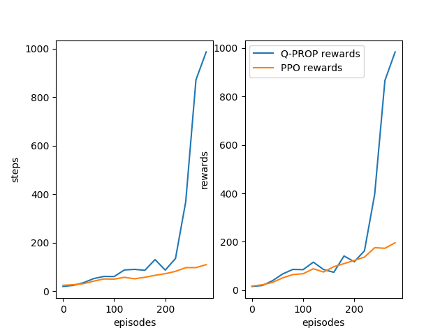

# RL-Robotic-Control

A preliminary comparison between Q-PROP and Proximal Policy Gradient.

Needs more rigorous test and polishing give out the full potential of the integrated on-policy ppo and off-policy ddpg training.