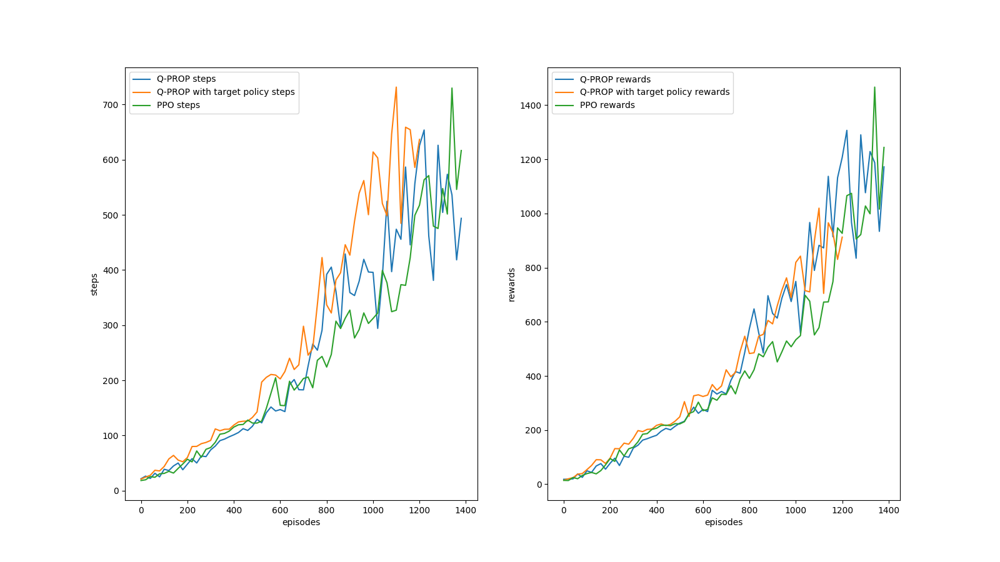
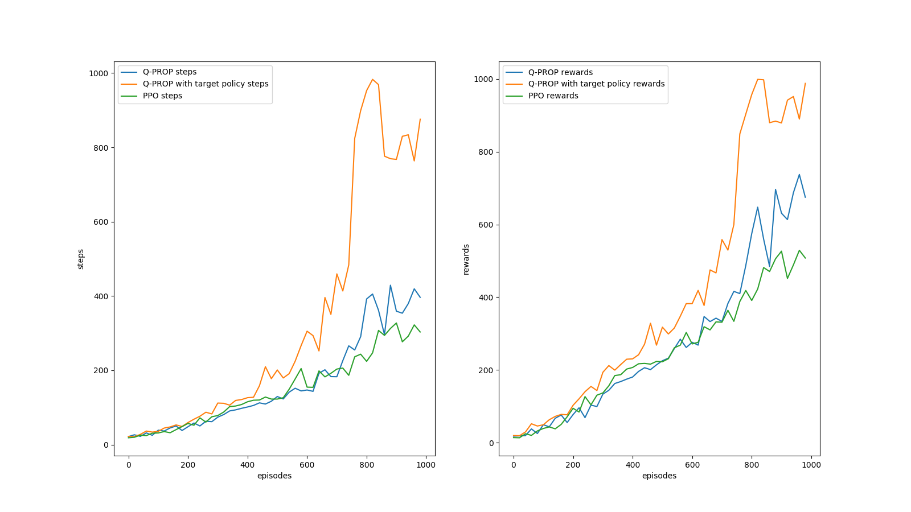
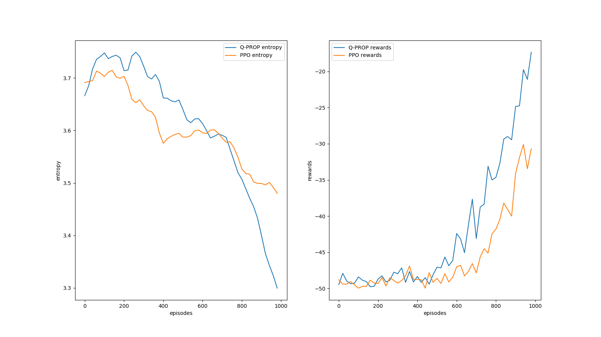

# RL-Robotic-Control

This repo aims to reproduce the *Q-PROP* algorithm based on an on-policy *Proximal Policy Optimization* method and an off-policy *Deep Deterministic Policy Gradient* method, as a part of McGIll COMP767 course project.

We are also interested in its newer adaptation, namely the *Interpolated Policy Gradient* method, whose evaluation constitutes the other half of this project, here is the link: [IPG](https://github.com/jianing-sun/Interpolated-Policy-Gradient-with-PPO-for-Robotics-Control-).

Comparisons are made between Q-PROP and the baseline PPO, in Hopper-v2 and FetchReach-v0 environments. However, as limited by the scope of the course project, the experiments conducted so far are inconclusive.  

## Hopper-v2 environment

Hopper-v2 is a fairly simple environment, with a 11 dimension observation space and a 3 dimention action space.

A ~~preliminary~~ fair comparison between Q-PROP and Proximal Policy Gradient in the Hopper-v2 environment. (Minibatch size 64)

DDPG has made use of the idea of double-Q learning, and its learning target for the critic network is bootstraped from a *target* critic network and a *target* policy network. The use of target networks can shrink bias, somehow.

It's not surprising that the Q-PROP algorithms have almost the same performance as the PPO baseline, because:
* the PPO baseline has been tuned to give out very good performance on mujoco control tasks (We adapted it from Patrick Coady's version; he has already done some good works); the Q-PROP unfortunately hasn't been so well tuned yet.
* Hopper-v2 is fairly simple.
* **Most importantly**, I'm not yet able to guarantee the correctness of this reproduced algorithm...

But sometimes, Q-PROP (with target networks) can have very impressive and contrastive performance in the Hopper-v2 environment, as shown in the figure below. 

Reinforcement learning algorithms have a lot of variance, even with control variate as employed in Q-PROP.

## FetchReach-v0 environment

FetchReach-v0 is slightly more complicated due to its limitation of short time steps per episode. Since Q-PROP has made of experience replay with determinstic off-policy learning, it is able to solve the task substantially faster.

This demonstrates that Q-PROP does have tangible improvements to the original PPO method, especially when PPO is a part of Q-PROP.

### Some observation so far
* Normalization of observation using a Scaler, as well as the GAE is crucial; should really consider adding batch normalization layers.
* Scaling rewards is essential for DDPG learning; adding time steps as feature is necessary for tasks with short time spans.
* Tons of tunable hyperparameters...and they need to be customized for different tasks and environments.
* Q critic is still not a satisfactory. Recommend using a learning rate of 1e-4 for Hopper-v2, sand 1e-3 for FetchReach-v0. (Actual implementation is still a little bit buggy...))
* Just empirically verified that updating Q Critic with a minibatch of size 64 is much better than 256! Don't know why, maybe it's becuase of Q critic overfitting?  
