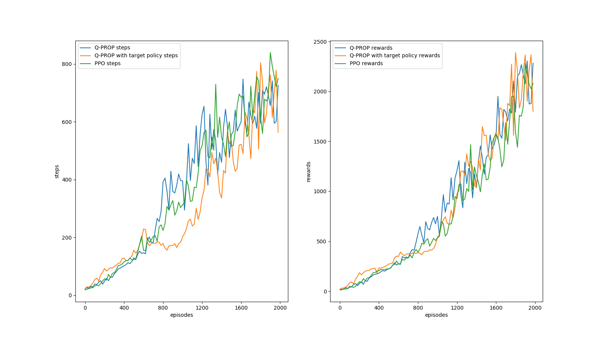

# RL-Robotic-Control

A preliminary comparison between Q-PROP and Proximal Policy Gradient in Hopper-v2 environment.

Needs more rigorous test and polishing give out the full potential of the integrated on-policy ppo and off-policy ddpg training.

Another comparison of the two algorithms in FetchReach-v0 environment.

This demonstrates that Q-PROP does have tangible improvements to the original PPO method, particularly when PPO is a part of Q-PROP.

( Disclaimer..This figures are inconclusive, because Q-PROP as of now is not stable yet... :( )

### Some observation so far
* Normalization of observation using a Scaler, as well as the GAE is crucial; should really consider adding batch normalization layers.
* Scaling rewards is essential for DDPG learning; adding time steps as feature is necessary for tasks with short time spans.
* Tons of tunable hyperparameters... 
