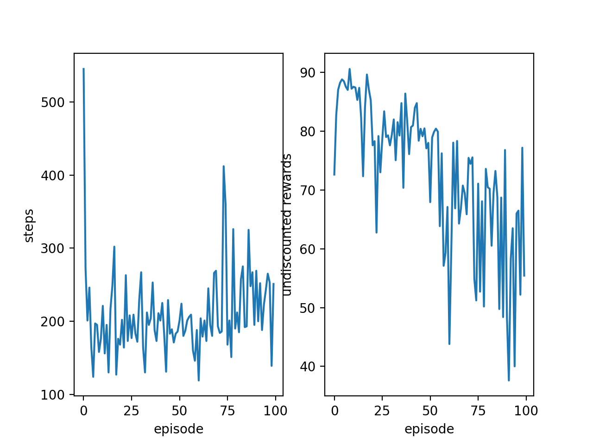

# RL-Robotic-Control

This section only uses the most fundamental eligibility trace, to an actor-critic architecture which uses function approximators  to policy and value function.

The weird thing is the undiscounted episodic reward keeps dropping as new episodes coming in. I haven't quite figured it out yet.

Some observations:
* Setting lambda to 1 and discount factor to near 1 could yields highest performance in the continuous mountain car problem.
* Initialization to the policy network is crucial.
* one layer MLP works better than multi-layers FNN, surprisingly.
* Need to bound the magnitude of policy update using KL divergence penalty or constraints, like in the TRPO or PPO methods.
* Batch methods may be more stable than updating policy and value function at each time step(hopeful noise in a batch would cancel each other out). An eligibility trace adaptation of the PPO method is worth exploring though.