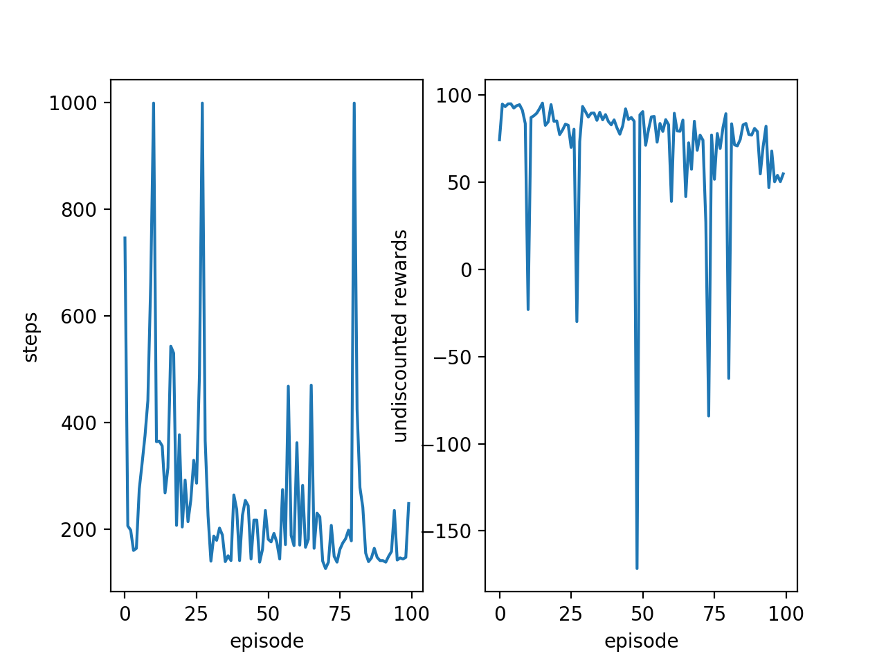
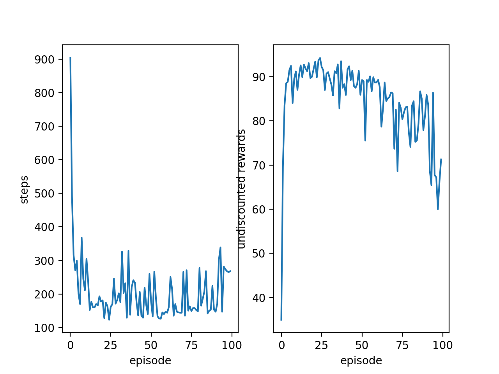

# RL-Robotic-Control

This section only uses the most fundamental eligibility trace, to an actor-critic architecture which uses function approximators  to policy and value function.

Continuous Mountain Car, MLP with eligibility traces
The weird thing is the undiscounted episodic reward keeps dropping as new episodes coming in. I haven't quite figured it out yet.

Continuous Mountain Car, two layers FNN with eligibility traces and rely activation function

Some observations:
* Setting lambda to 0.4 and discount factor to near 1 have yielded the best performance in the continuous mountain car problem, as observed so far.
* Overall, the lambda and discount factors play a very crucial role in eligibility trace.
* The learning rate also needs to be carefully chosen, and better make it adaptive! Like using the learning rate of 1e-3 for one layer MLP, and 1e-5 for the multi-layers FNN.
* Initialization to the policy network is crucial.
* Need to bound the magnitude of policy update using KL divergence penalty or constraints, like in the TRPO or PPO methods.
* Batch methods may be more stable than updating policy and value function at each time step(hopeful noise in a batch would cancel each other out). An eligibility trace adaptation of the PPO method is worth exploring though.